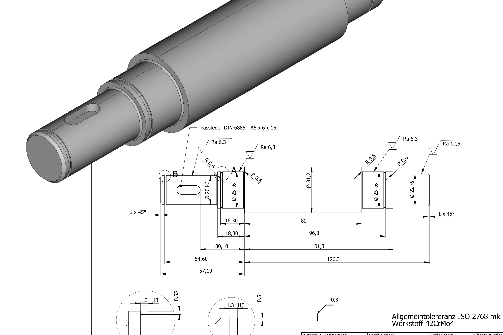

# FreeCAD-TechDraw-Symbols

## Getting Started
1. Download surface roughness symbol
2. Create a Balloon Annotation and remove the balloon and text from that
3. Import the downloaded surface roughness symbol onto the drawing page and move it to the Balloon Annotation
4. Add surface roughness parameters as Text Annotation

## Symbols

